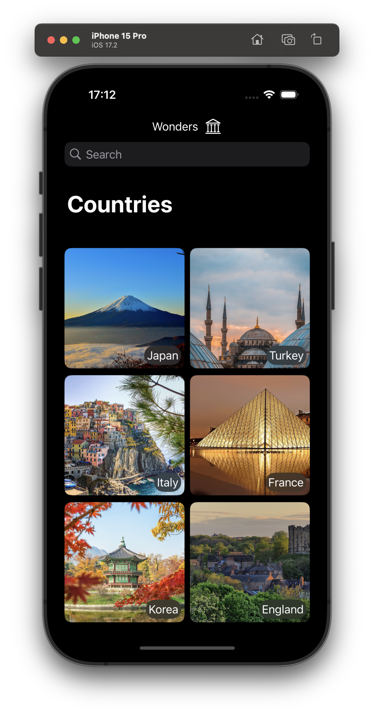

&nbsp;&nbsp;&nbsp;&nbsp;&nbsp;&nbsp;&nbsp;&nbsp;
&nbsp;&nbsp;&nbsp;&nbsp;&nbsp;&nbsp;&nbsp;&nbsp;

# Wonders

Wonders is an iOS app developed using SwiftUI, accompanied by a robust backend server developed with ASP.NET Core. The app serves as a comprehensive guide for users to explore tourist attractions and must-visit places in various countries.

## Features

- **Country Selection:** Users are presented with a grid of country images and names on the home screen. A search bar allows users to quickly locate a specific country of interest.

- **Tourist Attractions:** Upon selecting a country, users can explore a list of tourist attractions. Each attraction is accompanied by an image, a name, and a categorization tag (e.g., historic place, museum).

- **Filter and Sort:** Users can refine their search by using the search bar to find a specific attraction. Tags enable users to filter attractions based on categories like historic places, museums, etc. Attractions can be sorted alphabetically for ease of navigation.

- **Attraction Details:** Tapping on an attraction provides detailed information. A larger image of the attraction is displayed, along with its current open/closed status. A small map shows the attraction's location using Apple Maps, offering both a standard and a 3D view.

- **Server Interaction:** The app fetches data from the ASP.NET Core server via GET requests. The server provides specific JSON data for countries, as well as images for both countries and attractions. Data is decoded into appropriate models for seamless integration into the app.

## How to Use

1. Use the home screen to visually select a country or employ the search bar for quicker access.
2. Tap on a country to view a list of tourist attractions.
3. Utilize search, tags, and alphabetical sorting to find specific attractions.
4. Tap on an attraction to access detailed information, like its current open/closed status, or the location.
5. Easily go back to select another attraction, explore more destinations, or choose a different country.

